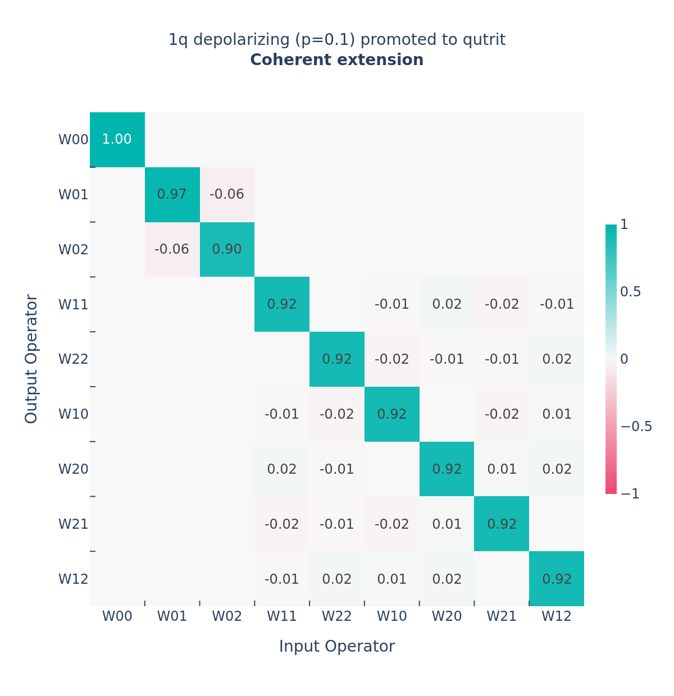
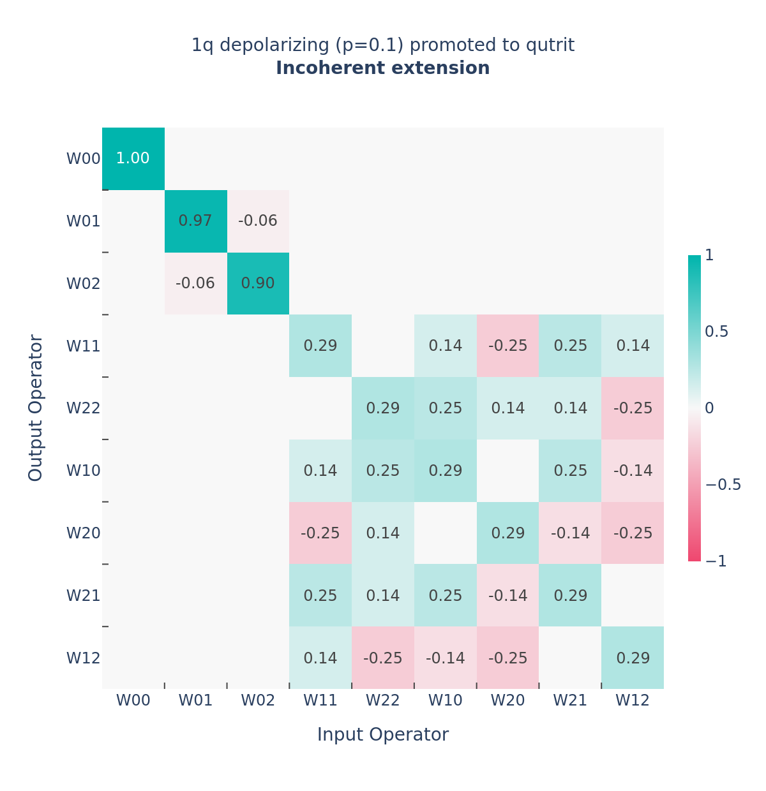
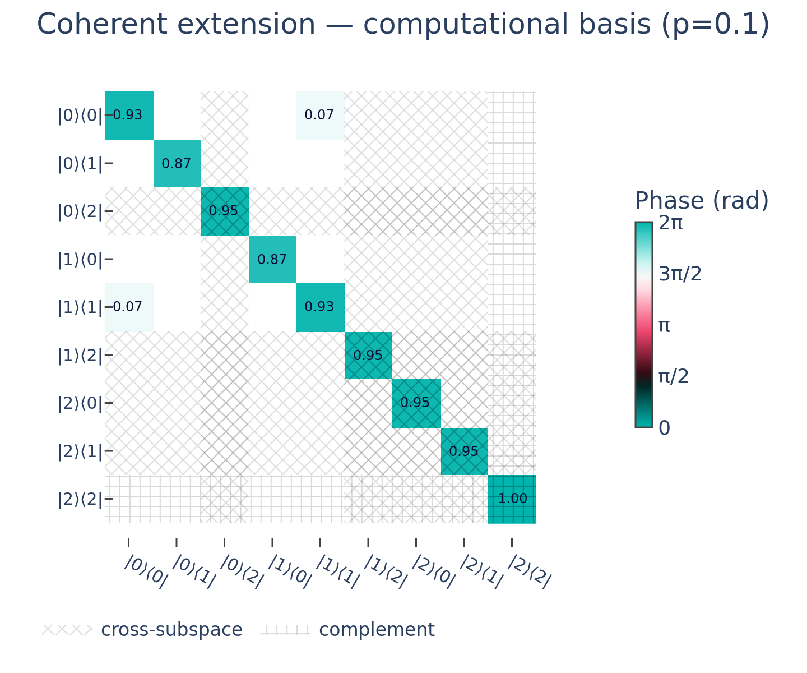
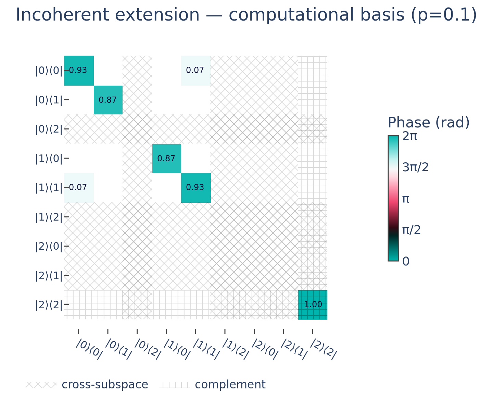

Promotion
=========

*Embedding quantum objects into a larger Hilbert space*

Quantum hardware rarely behaves as the idealized two-level system we use to reason
about qubits. Superconducting transmons, for example, are weakly anharmonic
oscillators whose :math:`|1\rangle \to |2\rangle` transition lies close to the
computational :math:`|0\rangle \to |1\rangle` transition. Modelling *leakage*
out of the computational subspace therefore requires embedding qubit states,
gates, and noise channels into a qutrit (or larger) Hilbert space. Quax calls this
operation **promotion** and exposes it through a single dispatched entry point,
:func:`~quax.promote`.

Throughout, fix a system of :math:`n` subsystems with computational dimensions
:math:`(d_1, \dots, d_n)` that we promote to larger dimensions
:math:`(D_1, \dots, D_n)` with :math:`D_k \ge d_k`. Write :math:`d = \prod_k d_k`
and :math:`D = \prod_k D_k` for the total dimensions, and let :math:`E` be the
embedding isometry that injects the computational space into the promoted one,
defined in the note below.

.. note::

   **Embedding isometry.** For each subsystem the embedding isometry
   :math:`E_k \in \mathbb{C}^{D_k \times d_k}` is the zero-padded identity,
   :math:`(E_k)_{ab} = \delta_{ab}` for :math:`a < d_k` (it copies the
   computational basis states :math:`|0\rangle, \dots, |d_k - 1\rangle` into the
   first :math:`d_k` levels of the larger space and sends nothing to the leaked
   levels). The full isometry is the tensor product
   :math:`E = \bigotimes_k E_k \in \mathbb{C}^{D \times d}`. It satisfies
   :math:`E^\dagger E = I_d` (it preserves inner products, so it is an isometry but
   not unitary), while :math:`P = E E^\dagger` is the projector onto the embedded
   computational subspace and :math:`P_\perp = I_D - P` projects onto the leaked
   levels.

The behaviour of :func:`~quax.promote` depends on what is being promoted: states
and operators are zero-padded, unitaries are identity-extended, channels use the
**coherent** Kraus extension, and quantum instruments use an **incoherent**
extension. The sections below treat each in turn, then discuss the family of
superoperator extensions, the Lindbladian justification for the coherent default,
and the important caveats that every user of channel promotion must understand.

1. Promotion of state vectors
------------------------------

A pure state :math:`|\psi\rangle \in \mathbb{C}^d` is promoted by the isometry,

.. math::
   :label: eq-promote-sv

   |\tilde\psi\rangle = E\,|\psi\rangle \in \mathbb{C}^D .

Concretely this zero-pads the amplitude vector: the computational amplitudes are
preserved and the leaked levels are assigned zero amplitude. Because
:math:`E^\dagger E = I_d`, the norm is preserved, :math:`\langle\tilde\psi|
\tilde\psi\rangle = \langle\psi|\psi\rangle`, so a normalized state stays
normalized. The promoted state has no support on the complement,
:math:`P_\perp|\tilde\psi\rangle = 0`, which is exactly what we want for the
initial preparation of a freshly reset qubit: it starts entirely within the
computational subspace.

.. code-block:: python

   import quax as qx

   psi = qx.random_state_vector(dims=(2,))
   promoted = qx.promote(psi, (3,))   # amplitudes [a, b]  ->  [a, b, 0]

2. Promotion of density matrices
--------------------------------

A density matrix :math:`\rho` is promoted by conjugating with the isometry,

.. math::
   :label: eq-promote-dm

   \tilde\rho = E\,\rho\,E^\dagger .

This zero-pads the rows and columns that index the leaked levels: the
:math:`d \times d` computational block is preserved and every entry touching a
leaked level is zero. The map is consistent with promotion of pure states, since
:math:`E|\psi\rangle\langle\psi|E^\dagger = |\tilde\psi\rangle\langle\tilde\psi|`,
and it preserves the trace, :math:`\operatorname{Tr}\tilde\rho =
\operatorname{Tr}(E^\dagger E\,\rho) = \operatorname{Tr}\rho`. It is positive
semidefinite whenever :math:`\rho` is, so a valid state is promoted to a valid
state supported entirely on the computational subspace.

.. code-block:: python

   rho = qx.random_density_matrix(rank=2, dims=(2,))
   promoted = qx.promote(rho, (3,))   # 2x2 block preserved, leaked row/col are 0

3. Promotion of unitaries
-------------------------

States are *padded* with zeros, but a gate must leave any already-leaked
population untouched. A unitary :math:`U` is therefore promoted by acting as
:math:`U` on the computational subspace and as the **identity** on the complement,

.. math::
   :label: eq-promote-unitary

   \tilde{U} = E\,U\,E^\dagger + P_\perp
   = \begin{pmatrix} U & 0 \\ 0 & I_{D-d} \end{pmatrix},

where the block form uses the basis ordering (computational levels first). The
result is unitary on the whole space: since :math:`E U E^\dagger` and
:math:`P_\perp` have orthogonal support, :math:`\tilde{U}^\dagger \tilde{U} =
E U^\dagger U E^\dagger + P_\perp = P + P_\perp = I_D`. A leaked basis state is an
eigenvector of eigenvalue one, :math:`\tilde{U}|{\perp}\rangle = |{\perp}\rangle`,
so the gate neither populates nor depopulates the leaked levels.

.. code-block:: python

   u = qx.random_unitary(dims=((2,), (2,)))
   promoted = qx.promote(u, (3,))   # block-diag(U, 1): identity on |2>

4. Promotion of operators
--------------------------

A generic :class:`~quax.Operator` (which may be non-unitary or non-Hermitian) is
**zero-padded** into the larger space:

.. math::
   :label: eq-promote-operator

   \tilde{A} = E\,A\,E^\dagger
   = \begin{pmatrix} A & 0 \\ 0 & 0 \end{pmatrix}.

Unlike a unitary, a general operator carries no constraint that forces the
complement subspace to be left unchanged. Zero-padding — embedding :math:`A` as
the top-left block of a larger zero matrix — is the natural linear extension: it
preserves the operator's action on the computational subspace and assigns no
output to states in the complement.

.. code-block:: python

   op = qx.random_operator(dims=((2,), (2,)), key=jax.random.key(0))
   promoted = qx.promote(op, (3,))   # 2×2 block preserved, leaked row/col are 0

5. Promotion of quantum instruments
-----------------------------------

A :class:`~quax.QuantumInstrument` describes a measurement (or other
classically-conditioned process) as a collection of completely positive maps
:math:`\{\mathcal{I}_m\}`, one per classical outcome :math:`m`, whose sum
:math:`\sum_m \mathcal{I}_m` is trace preserving. A measurement *destroys*
coherence between the computational and leaked subspaces, so an instrument is
promoted by the **incoherent** extension (the channel case, where that coherence
is instead retained, is treated in Section 6).

Each outcome map is zero-padded into the larger space,
:math:`\hat{\mathcal{I}}_m(\rho) = \sum_i \hat{K}_{m,i}\,\rho\,\hat{K}_{m,i}^\dagger`,
and the complement is restored by appending the projector :math:`P_\perp` as a
*separate* Kraus operator to a single outcome. Quax assigns it to the
highest-index outcome :math:`M`, where the outcomes are indexed
:math:`m = 0, \dots, M`:

.. math::
   :label: eq-promote-instrument

   \tilde{\mathcal{I}}_m(\rho) =
   \begin{cases}
     \hat{\mathcal{I}}_m(\rho), & m < M, \\[4pt]
     \hat{\mathcal{I}}_M(\rho) + P_\perp\,\rho\,P_\perp, & m = M.
   \end{cases}

Summing over outcomes restores :math:`\sum_m \tilde{\mathcal{I}}_m` to a CPTP map
(the padded maps supply :math:`P` and the appended projector supplies
:math:`P_\perp`), while the separate :math:`P_\perp\,\rho\,P_\perp` term destroys
all coherence between the computational and complement subspaces. For dispersive
readout this matches the typical experimental behaviour: a leaked :math:`|2\rangle`
lands near the :math:`|1\rangle` IQ blob and is recorded as the highest
computational outcome, with no residual coherence to the measured subspace.

Why the incoherent extension here rather than the coherent one used for channels?
The distinction is physical, not merely conventional. A measurement extracts
classical information: recording an outcome collapses the state and severs any
coherence between the subspace that was "read out" and the leaked levels, exactly
the decoherence that the separate :math:`P_\perp\,\rho\,P_\perp` term enforces.

6. Promotion of noise channels
------------------------------

Promoting a noise channel is the substantive case. The trustworthy way to promote a noise channel is by exponentiating the embedded Lindbladian that is constructed from the embedded Hamiltonian and Lindblad jump operators, using the promition method in Section 4. If one does not know the qubit Hamiltonian and/or Lindblad operators, the question of how to promote a noise channel is ill-defined, and therefore not possible to answer reliably. We can specify criteria that a promoted superoperator should satisfy:

1. The embedded channel :math:`\tilde{\mathcal{E}}` on the
:math:`D`-dimensional space **reproduces** :math:`\mathcal{E}` on the
computational subspace, and 

2. The embedded channel :math:`\tilde{\mathcal{E}}` on the
:math:`D`-dimensional space preserves the population of the complement space, i.e., **acts as the identity** on the complement.

These criteria do not specify how the embedded channel should affect the coherences between the computational and leaked states. If one is interested in only calculating the populations and coherences in the computational states, and population in the leaked states, and not interested in calculating the coherences between the computational and leaked states, there exist ways to promote the superoperator directly, without requiring knowledge of the Hamiltonian and/or jump operators.

In this section, we will describe a method to promote the superoperator, by promoting the Kraus operators. Note that the Kraus representation of a noise channel is not unique, therefore different Kraus representations will give different answers; However, they will all give the same answers for the populations and coherences in the computational states, and population in the leaked states.

Any noise channel must be CPTP. Complete positiveness is automatically enforced by the Kraus representation. Trace preservation is enforced by the completeness relation :math:`\hat{K}_i^\dagger \hat{K}_i = 1`. There are many ways to promote the Kraus operators such that they satisfy completeness, and the other two criteria stated above. The choices provided by :func:`~quax.promote` are described below.

.. _promotion-choices:

Promotion choices
~~~~~~~~~~~~~~~~~

Coherent extension (default)
^^^^^^^^^^^^^^^^^^^^^^^^^^^^^

Pad (any) one Kraus operator with a 1 in the qutrit space, and all the other Kraus operators with 0 in the qutrit space. By default, :func:`~quax.promote` pads a 1 on the Kraus operator which is the leading eigenvector of the Choi matrix. Mathematically, this is done as

.. math::
   :label: eq-coherent

   \tilde{K}_0 = \hat{K}_0 + P_\perp, \qquad \tilde{K}_{i>0} = \hat{K}_i .

This is the **default extension** used by :func:`~quax.promote` for channel types.
It does not forcibly dephase the computational-complement coherences, and is
*exact* for a unitary channel — which has a single Kraus operator, so the
coherent extension reduces exactly to Eq. :eq:`eq-promote-unitary`.

For many physically relevant channels — amplitude damping, cascade decay, thermal
relaxation — this coherent extension can agree *exactly* with the zero-padded
Lindbladian approach. For a time-independent Lindbladian this agreement holds
when the first Kraus operator :math:`K_0` from the canonical (Choi-eigenvector)
decomposition equals the no-jump propagator
:math:`\exp\!\bigl((-iH - \tfrac{1}{2}\sum_k L_k^\dagger L_k)t\bigr)`, up to the
global-phase convention described below. This condition should be checked in
models with nontrivial Hamiltonians or degenerate Choi spectra; it can be verified
analytically for a broad class of channels and is confirmed by the tests in
``tests/test_promotion.py``.

.. _promotion-decomposition-warning:

.. warning::

   **The coherent extension is Kraus-decomposition-dependent. Use it with care.**

   Unlike the incoherent extension, the coherent extension gives a promoted channel
   that depends on *which* Kraus operator is called :math:`K_0`. Two Kraus
   representations of the **same** channel can produce **different** promoted
   channels. The promoted channels have identical action on the computational
   subspace and on the complement subspace in isolation; they differ only in the
   cross-block (computational :math:`\leftrightarrow` complement) coherences. This
   difference is invisible for block-diagonal states and observables, but shows up
   in density-matrix simulations with cross-subspace coherences, trajectory
   unravellings, and any observable that mixes the two subspaces.

   **Phase of** :math:`K_0` **also matters.** Because :math:`P_\perp` is a real
   projector and does not share the global phase of :math:`K_0`, replacing
   :math:`K_0` by :math:`e^{i\theta} K_0` changes the promoted channel. Quax
   canonicalizes the phase by requiring that the element of :math:`K_0` with the
   largest magnitude be real and positive. This convention is applied uniformly —
   including when inputs are batched — so that results are independent of batch
   size. Any external code that constructs Kraus operators and feeds them as a
   :class:`~quax.KrausMap` should be aware that the global phase of the first
   operator affects the promoted channel.

   **Which decomposition does Quax use?** When you pass a :class:`~quax.SuperOp`,
   :class:`~quax.Choi`, or :class:`~quax.PauliLiouville` to :func:`~quax.promote`,
   Quax internally converts to the **canonical Choi-eigenvector decomposition**:
   :math:`K_0` is the Kraus operator corresponding to the *largest* eigenvalue of
   the Choi matrix. This is unique (up to the global-phase convention above) and
   corresponds physically to the dominant no-error branch. When you pass a
   :class:`~quax.KrausMap` directly, Quax honours **your** :math:`K_0` (the first
   operator in the map) — so the two paths can yield different promoted channels for
   the same underlying channel.

   **Practical guidance.** If the channel arises from a known Lindbladian with
   clearly identified jump operators, the most faithful promotion is via the
   Lindbladian zero-padding route described above: construct the promoted channel
   by zero-padding :math:`H` and each :math:`L_k`, then exponentiate. The coherent
   extension of the canonical Choi-eigenvector decomposition agrees with this for
   many common channels but should be verified on a case-by-case basis. If in doubt,
   supply the Lindblad-derived channel directly rather than promoting a pre-computed
   superoperator.

Incoherent extension
^^^^^^^^^^^^^^^^^^^^

Add :math:`P_\perp` as a *separate* Kraus operator rather than folding it into an
existing one:

.. math::
   :label: eq-incoherent

   \tilde{\mathcal{E}}(\rho) = \sum_i \hat{K}_i\, \rho\, \hat{K}_i^\dagger
   + P_\perp\, \rho\, P_\perp .

This destroys all coherence between the computational and complement subspaces. It
is the physically correct extension for **measurements and resets**, where the
leaked levels genuinely decohere from the computational state, and is what Quax
uses when promoting a :class:`~quax.QuantumInstrument` (Section 5). It is exposed
directly as :func:`~quax.promote_incoherent`. The incoherent extension is
decomposition-independent: the :math:`P_\perp\,\rho\,P_\perp` contribution is the
same regardless of which Kraus set represents :math:`\mathcal{E}`.

.. _promotion-trajectories:

Use in Kraus-trajectory simulations
~~~~~~~~~~~~~~~~~~~~~~~~~~~~~~~~~~~~~

The choice of extension matters most in **Kraus-trajectory (Monte-Carlo
wavefunction) simulation**, where a pure state :math:`|\psi\rangle` is propagated
by sampling a single Kraus branch :math:`i` with probability
:math:`p_i = \lVert \tilde{K}_i |\psi\rangle \rVert^2` and renormalizing.
Averaging over many trajectories reproduces the channel's action on the density
matrix. The extension choice is invisible for block-diagonal inputs and
observables, but it changes the average density matrix whenever cross-subspace
coherences are present. As stated before, these promotion choices should not be trusted to reliably produce cross-subspace
coherences. The choice of extension also governs the *correlations* along individual
trajectories.

Under the **coherent extension** (the default):

* **Error branches annihilate leaked population.** For noise whose jump operators
  are zero-padded within the computational subspace (e.g. depolarizing, amplitude
  damping), each error Kraus :math:`\hat{K}_{i>0}` has no matrix elements for
  leaked states. Sampling an error branch therefore collapses the leaked probability
  to zero, which is the physically correct outcome: observing a qubit-subspace
  interaction implies the system was in the qubit subspace.
* **The no-error branch preserves leaked population.** :math:`\tilde{K}_0 =
  \hat{K}_0 + P_\perp` maps any leaked state to itself. A system that was leaked
  and experienced no jump simply remains leaked with unit amplitude; in a
  computational-leakage superposition, the computational component is scaled by
  :math:`\hat{K}_0` while the leaked component is left untouched.
* **Exact for unitaries.** A unitary channel has a single Kraus operator, so
  :math:`K_0 = U` and the coherent extension reduces to
  Eq. :eq:`eq-promote-unitary`. Promoting ideal gates is unchanged.

Measurements and resets use the **incoherent extension** regardless of this
setting, as Quax does automatically when promoting a
:class:`~quax.QuantumInstrument`.

Worked example: depolarizing noise on a transmon
^^^^^^^^^^^^^^^^^^^^^^^^^^^^^^^^^^^^^^^^^^^^^^^^^

Consider single-qubit depolarizing noise,

.. math::
   :label: eq-depol

   \mathcal{E}(\rho) = (1-p)\,\rho + \frac{p}{3}\big(X\rho X + Y\rho Y + Z\rho Z\big),

with canonical Choi-eigenvector Kraus operators :math:`K_0 = \sqrt{1-p}\,I` and
:math:`K_{1,2,3} = \sqrt{p/3}\,\{Z, X, Y\}`. Promoting to a qutrit
(:math:`d = 2 \to D = 3`) with :math:`P_\perp = |2\rangle\!\langle 2|` via the
coherent extension gives

.. math::
   :label: eq-depol-promoted

   \tilde{K}_0 = \begin{pmatrix} \sqrt{1-p}\,I & 0 \\ 0 & 1 \end{pmatrix}, \qquad
   \tilde{K}_{i>0} = \begin{pmatrix} K_i & 0 \\ 0 & 0 \end{pmatrix}.

The no-error branch preserves :math:`|2\rangle`, while the error branches
(:math:`Z`, :math:`X`, :math:`Y`) annihilate it. In Quax:

.. code-block:: python

   import jax.numpy as jnp
   import quax as qx

   p = 0.1
   channel = qx.depolarizing_operators(p)    # qubit KrausMap (d = 2)
   promoted = qx.promote(channel, (3,))      # coherent extension (default)

   # The no-error branch (K_0) maps |2> to |2> with amplitude 1.
   # Every error branch (K_1, K_2, K_3) maps |2> to 0.
   print(promoted.matrix[:, 2, 2])           # [1.0, 0.0, 0.0, 0.0]

The difference between the two extensions is most directly visible in the
computational-basis superoperator matrix of the promoted channel. The
:math:`9 \times 9` matrix for a qutrit superoperator has rows and columns indexed
by vectorized density-matrix elements
:math:`|i\rangle\!\langle j|`, such as :math:`|0\rangle\!\langle 1|` and
:math:`|0\rangle\!\langle 2|`. The entries split into comp-comp elements
(:math:`i,j \in \{0,1\}`), cross-subspace coherences (exactly one of
:math:`i,j` is :math:`2`), and the complement population
:math:`|2\rangle\!\langle 2|`. This basis makes the physical difference between
coherent and incoherent extension visible without any change of operator basis.

   **Coherent extension** of 1-qubit depolarizing (:math:`p = 0.1`) promoted to a
   qutrit. The comp-comp block, indexed by
   :math:`|0\rangle\!\langle 0|`, :math:`|0\rangle\!\langle 1|`,
   :math:`|1\rangle\!\langle 0|`, and :math:`|1\rangle\!\langle 1|`, recovers the
   original qubit depolarizing channel. The cross-subspace coherences
   :math:`|0\rangle\!\langle 2|`, :math:`|1\rangle\!\langle 2|`,
   :math:`|2\rangle\!\langle 0|`, and :math:`|2\rangle\!\langle 1|` are not mixed
   with the comp-comp block; each is scaled by the no-error amplitude
   :math:`\sqrt{1-p}`. The complement population :math:`|2\rangle\!\langle 2|`
   is fixed with eigenvalue 1. Hatched regions identify entries outside the qubit
   computational subspace: **×** marks cross-subspace coherences and **+** marks
   the complement population.

   **Incoherent extension** of the same channel. The comp-comp block and the
   complement population are identical to the coherent case, so both extensions
   agree on ordinary computational-subspace dynamics and on already-leaked
   populations. The cross-subspace block is different: the separate
   :math:`P_\perp\rho P_\perp` Kraus operator removes all
   :math:`|0\rangle\!\langle 2|`, :math:`|1\rangle\!\langle 2|`,
   :math:`|2\rangle\!\langle 0|`, and :math:`|2\rangle\!\langle 1|`
   coherences. Hatched regions use the same convention as the coherent-extension
   figure above.

Starting from a coherent superposition :math:`(|1\rangle + |2\rangle)/\sqrt{2}`,
the depolarizing channel decoheres the qubit component while the no-error branch
maintains cross-subspace coherence:

.. code-block:: python

   psi = jnp.array([0.0, 1.0, 1.0], dtype=complex) / jnp.sqrt(2.0)
   rho = jnp.outer(psi, psi.conj())

   coherent = qx.kraus_to_superop(qx.promote(channel, (3,)))
   incoherent = qx.promote_incoherent(qx.kraus_to_superop(channel), (3,))

   rho_c = (coherent.matrix  @ rho.ravel()).reshape(3, 3)
   rho_i = (incoherent.matrix @ rho.ravel()).reshape(3, 3)

   print(abs(rho_c[1, 2]))   # > 0  : coherent retains computational<->leaked coherence
   print(abs(rho_i[1, 2]))   # = 0  : incoherent destroys it

The coherent (default) extension retains a partial :math:`\rho_{12}` coherence
via the no-error Kraus branch, whereas the incoherent extension — appropriate for
a measurement or reset — removes it entirely.

Computational-basis block structure
^^^^^^^^^^^^^^^^^^^^^^^^^^^^^^^^^^^^

The computational-basis superoperator makes cross-subspace coherences explicit:
rows and columns index vectorised density-matrix elements
:math:`|i\rangle\!\langle j|`. The :math:`D^2 = 9` elements fall into three
subspace types —

.. math::

   \underbrace{\rho_{00},\,\rho_{01},\,\rho_{10},\,\rho_{11}}_{\text{comp–comp}}
   \quad
   \underbrace{\rho_{02},\,\rho_{12},\,\rho_{20},\,\rho_{21}}_{\text{cross}}
   \quad
   \underbrace{\rho_{22}}_{\text{complement}}

— and the figures below use **×** hatching on the cross-subspace rows/columns and
**+** hatching on the complement row/column so that the block structure is
immediately visible without reordering.

   **Coherent extension** in the computational basis. **×** hatching marks the four
   cross-subspace density-matrix elements
   (:math:`\rho_{02},\,\rho_{12},\,\rho_{20},\,\rho_{21}`) and **+** hatching marks
   the complement element (:math:`\rho_{22}`). The four cross-subspace rows and
   columns each scale by :math:`\sqrt{1-p} \approx 0.95` (the no-error amplitude)
   but are not mixed with each other or with the computational block. The comp–comp
   :math:`4 \times 4` sub-block (rows/columns 0–1, 3–4) recovers the standard qubit
   depolarizing Liouville matrix. The complement entry is 1.

   **Incoherent extension** in the computational basis. Hatching uses the same
   convention as the coherent-extension figure above. The cross-subspace block (×)
   is identically zero: all cross-subspace coherences are completely destroyed,
   regardless of the input state. The comp–comp and complement entries are unchanged
   relative to the coherent case.

API reference
-------------

* :func:`~quax.promote` — promote a quantum object: zero-pad states and operators,
  identity-extend unitaries, apply the **coherent** Kraus extension to channels, and
  apply the **incoherent** extension to quantum instruments.
* :func:`~quax.promote_incoherent` — the incoherent extension for measurements and
  resets, applied directly to a superoperator.
* :func:`~quax.embed` — positional embedding of an object into specified qudits of a
  larger register (built on :func:`~quax.promote`).
