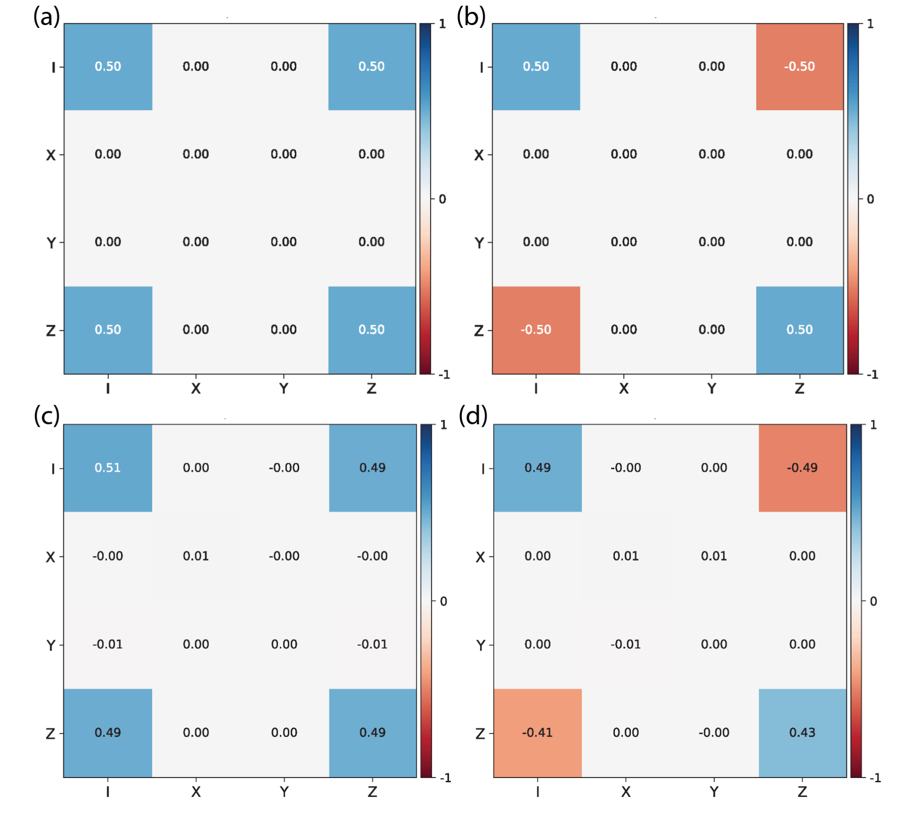
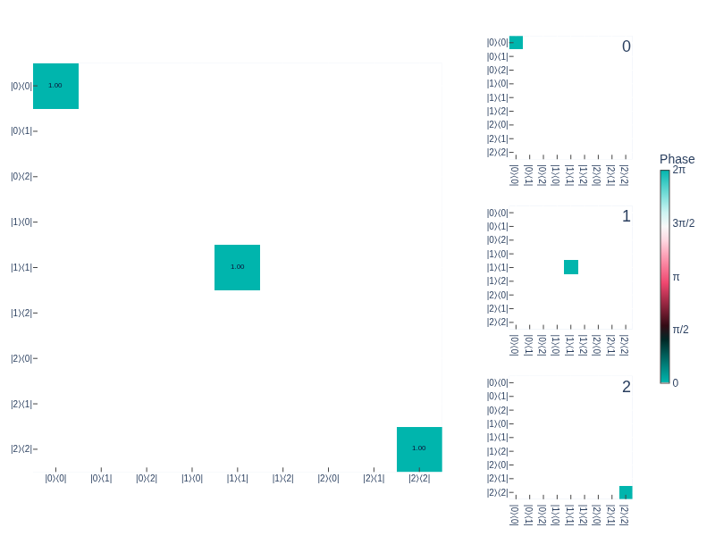
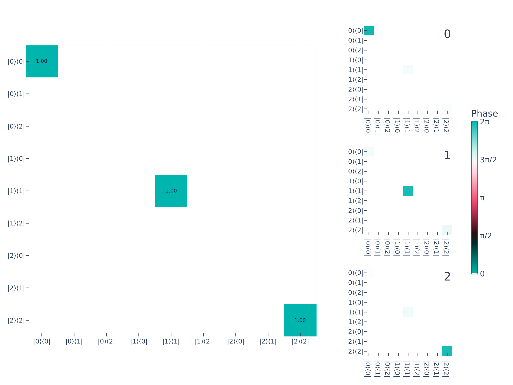
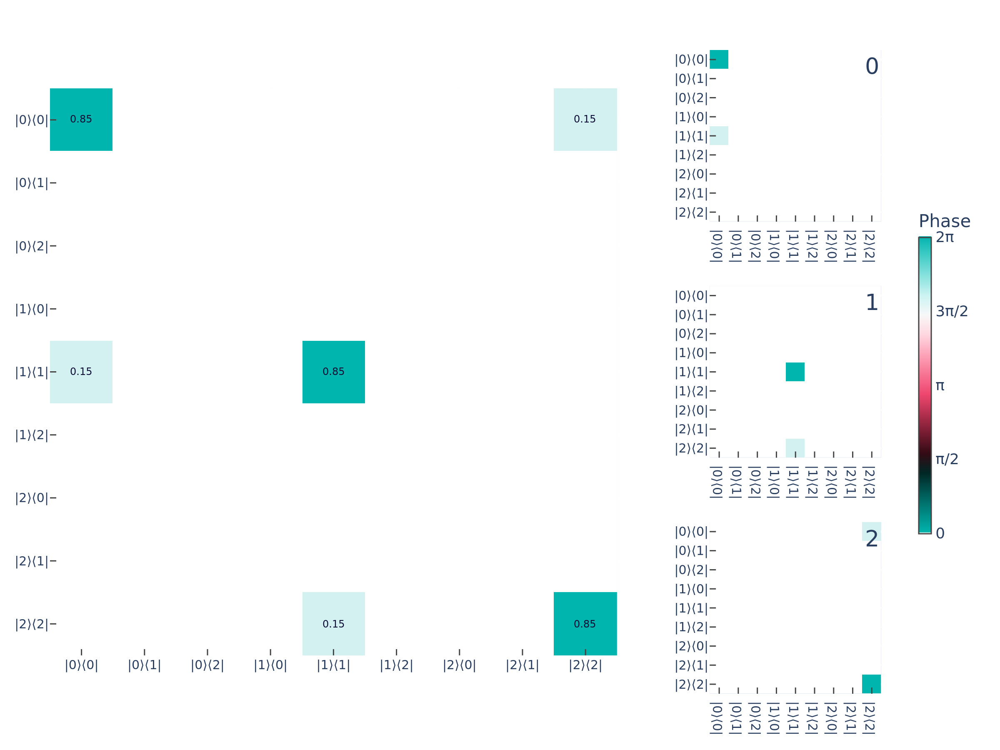
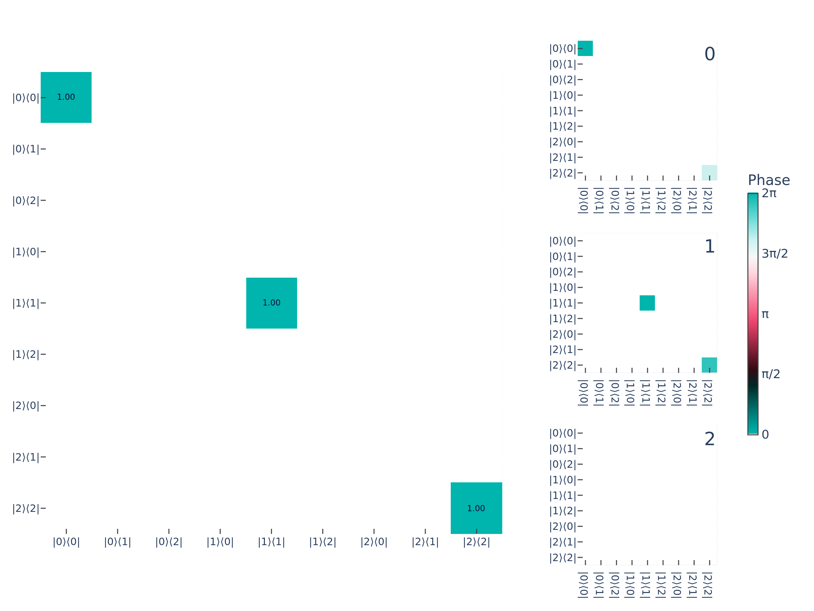
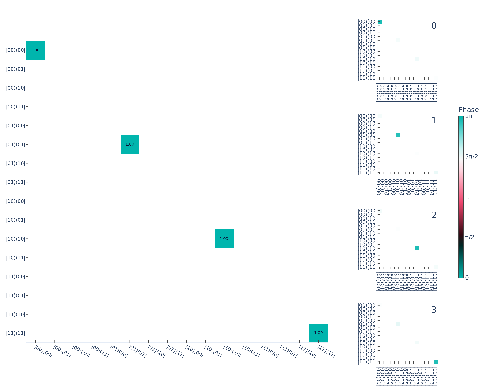
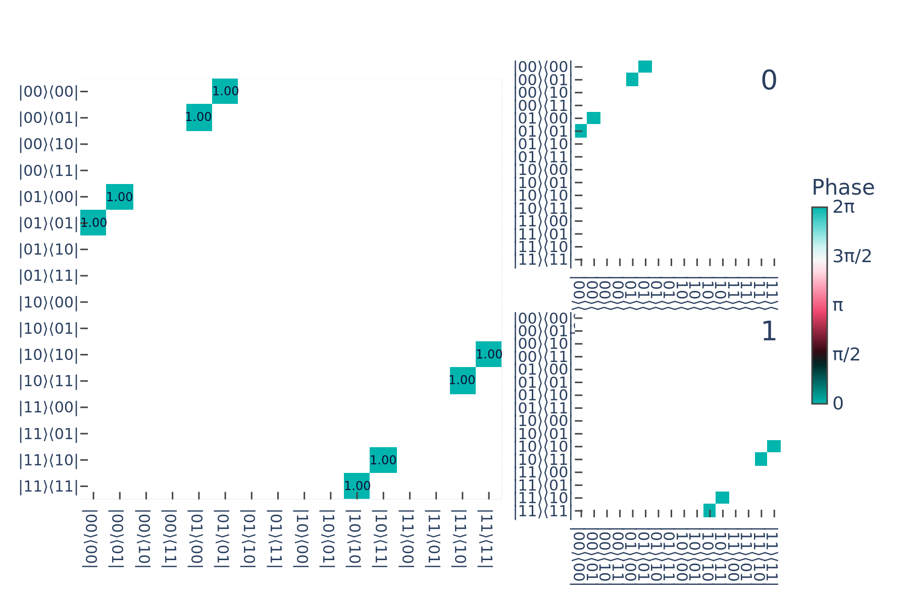

Quantum Instruments
===================

.. note::

   This document is adapted from Akel Hashim's note, `Understanding Quantum Instruments <https://arxiv.org/abs/2604.18884>`_.

Background
----------

End-of-circuit ("terminating") measurements in quantum computations are modeled with
projection-valued measures (PVMs) or, more generally, positive operator-valued measures
(POVMs) :cite:`PIBC`. However, the POVM formalism, which maps a quantum state to a
classical probability distribution :math:`\rho \mapsto \{ p(i|\rho) \}`, cannot describe
mid-circuit measurements (MCMs), where the post-measurement state is reused in further
computations. The *quantum instrument* (QI) formalism addresses this by modeling quantum
processes as completely positive, trace-preserving (CPTP) maps that output a joint
quantum-classical state :cite:`OAQP`,
:math:`\rho \mapsto \{ [\rho_i, p(i|\rho)] \}`. QIs therefore capture *measurement
back action* :cite:`QBACK`, which is essential for predicting and understanding MCM
outcomes :cite:`QINST`. From a broader theoretical perspective, the QI formalism
connects naturally to quantum foundations, including the modern theory of quantum
measurement :cite:`OZQM,QINST,PRQI` and quantum (in)compatibility
:cite:`QCOMP,QINC`, as well as quantum networks :cite:`QNET`.

Formally, a QI :math:`\mathcal{I}` is a CPTP map that transforms a quantum state
:math:`\rho` as:

.. math::
   :label: eq-QI

   \mathcal{I}: \rho \mapsto \mathcal{I}(\rho) = \sum_i \mathcal{E}_i(\rho)
   \otimes |i\rangle\!\langle i|

where each :math:`\mathcal{E}_i(\rho)` is a CP process which dictates the probability
that a measurement outcome :math:`i` is observed given an input state :math:`\rho`
(i.e., :math:`p(i|\rho) = \mathrm{Tr}[\mathcal{E}_i(\rho)]`), and
:math:`|i\rangle\!\langle i|` is the projector associated with the classical outcome
:math:`i`. The post-measurement state (conditioned on the classical outcome :math:`i`)
is

.. math::
   :label: eq-post-meas-state

   \rho_i = \frac{\mathcal{E}_i(\rho)}{\mathrm{Tr}[\mathcal{E}_i(\rho)]}

For :math:`\mathcal{I}` to be both CP *and* TP, we require that the sum over all
elements of the set :math:`\{\mathcal{E}_i\}` preserves total probability:

.. math::
   :label: eq-tp

   \mathrm{Tr}[\rho] = \sum_i \mathrm{Tr}[\mathcal{E}_i(\rho)] = 1

While the post-measurement state :math:`\rho_i` is correlated with the classical
outcome :math:`i`, it is important to note that they live in different output spaces.
Concretely, if the input state :math:`\rho` is a vector in
:math:`\mathcal{L}(\mathcal{H}_A)`, where :math:`\mathcal{H}_A = \mathbb{C}^d` and
:math:`d = D^n` (for :math:`n` qudits of dimension :math:`D`) is the corresponding
Hilbert space, then the quantum instrument transforms
:math:`\mathcal{L}(\mathcal{H}_A)` as:

.. math::
   :label: eq-hilbert-space

   \mathcal{I}: \mathcal{L}(\mathcal{H}_A) \mapsto
   \mathcal{L}(\mathcal{H}_B) \otimes \mathcal{L}(\mathcal{H}_K)

where :math:`\mathcal{H}_K = \mathbb{C}^{|K|}` is the Hilbert space of the classical
register with :math:`|K|` possible measurement outcomes. For example, for performing a
measurement on a single-qubit input state,
:math:`\mathcal{H}_A = \mathcal{H}_B = \mathcal{H}_K = \mathbb{C}^2`.

Errors in Quantum Instruments
-----------------------------

   Ideal (target) PTM for the measure 0 element of a single-qubit QI. (b) Ideal (target) PTM for
   the measure 1 element of a single-qubit QI. (c) Experimental PTM for the measure 0 element of
   a single-qubit QI. (d) Experimental PTM for the measure 1 element of a single-qubit QI

Quantum instruments represent valid CPTP processes, but they decompose into :math:`d`
different CP processes whose sum must be TP. This complicates the direct interpretation
of the PTM representation of errors. Moreover, QIs do
not just model quantum errors, but must also capture purely classical effects such as
*readout infidelity* (i.e., *assignment error*), which can be due to quantum effects
(e.g., :math:`T_1` decay) or classical effects (e.g., shot noise, poor signal-to-noise
ratio, etc.).
Since a QI decomposes into a joint quantum-classical state after measurement,
it requires a modification in how we typically interpret errors in the PTM
representation of CPTP processes.

To begin with, we take the simple example of a QI for a single-qubit system (i.e., a
2-outcome MCM):

.. math::
   :label: eq-errors-in-quantum-instruments-1

   \mathcal{I}(\rho)
   = \mathcal{E}_0(\rho) \otimes |0\rangle\!\langle 0|
   + \mathcal{E}_1(\rho) \otimes |1\rangle\!\langle 1|

We denote the PTMs of :math:`\mathcal{E}_0` and :math:`\mathcal{E}_1` as
:math:`\Lambda^{(0)}` and :math:`\Lambda^{(1)}`, respectively. Using the notation
introduced in the previous section, we may write them out as

.. math::
   :label: eq-errors-in-quantum-instruments-2

   \Lambda^{(0)} = \begin{pmatrix}
   \Lambda^{(0)}_{II} & \Lambda^{(0)}_{IX} & \Lambda^{(0)}_{IY} & \Lambda^{(0)}_{IZ} \\
   \Lambda^{(0)}_{XI} & \Lambda^{(0)}_{XX} & \Lambda^{(0)}_{XY} & \Lambda^{(0)}_{XZ} \\
   \Lambda^{(0)}_{YI} & \Lambda^{(0)}_{YX} & \Lambda^{(0)}_{YY} & \Lambda^{(0)}_{YZ} \\
   \Lambda^{(0)}_{ZI} & \Lambda^{(0)}_{ZX} & \Lambda^{(0)}_{ZY} & \Lambda^{(0)}_{ZZ}
   \end{pmatrix}

and

.. math::
   :label: eq-qi-qubit

   \Lambda^{(1)} = \begin{pmatrix}
   \Lambda^{(1)}_{II} & \Lambda^{(1)}_{IX} & \Lambda^{(1)}_{IY} & \Lambda^{(1)}_{IZ} \\
   \Lambda^{(1)}_{XI} & \Lambda^{(1)}_{XX} & \Lambda^{(1)}_{XY} & \Lambda^{(1)}_{XZ} \\
   \Lambda^{(1)}_{YI} & \Lambda^{(1)}_{YX} & \Lambda^{(1)}_{YY} & \Lambda^{(1)}_{YZ} \\
   \Lambda^{(1)}_{ZI} & \Lambda^{(1)}_{ZX} & \Lambda^{(1)}_{ZY} & \Lambda^{(1)}_{ZZ}
   \end{pmatrix}

:math:`\Lambda^{(0)}` (:math:`\Lambda^{(1)}`) models the quantum process that is
conditional on observing the measurement outcome 0 (1), and
:math:`\Lambda^{(0)} + \Lambda^{(1)}` models the quantum process in which the classical
outcome is discarded after measurement.

Trace Preservation
~~~~~~~~~~~~~~~~~~

Because each :math:`\mathcal{E}_i` is not TP, there is no requirement that
:math:`\Lambda^{(0)}_{0j} = \Lambda^{(1)}_{0j} = \delta_{0j}` [#tp-notation]_.
Instead, we only require that
:math:`\Lambda^{(0)}_{0j} + \Lambda^{(1)}_{0j} = \delta_{0j}`.
This TP constraint means that :math:`\Lambda^{(0)}_I` and :math:`\Lambda^{(1)}_I` are
not linearly independent (more on this below).
In the figure (see above), we plot the PTMs :math:`\Lambda^{(0)}` and
:math:`\Lambda^{(1)}` for an ideal QI, as well as the experimental PTMs measured via QI
linear gate-set tomography (QILGST) :cite:`QILGST`.
We observe that in the ideal case,
:math:`\Lambda^{(0)}_I = (0.5, 0, 0, 0.5)` and
:math:`\Lambda^{(1)}_I = (0.5, 0, 0, -0.5)`, but experimentally we measure
:math:`\Lambda^{(0)}_I = (0.51, 0, 0, 0.49)` and
:math:`\Lambda^{(1)}_I = (0.49, 0, 0, -0.49)`.
Thus, although there are errors in our QI, this process is indeed TP since
:math:`\Lambda^{(0)}_I + \Lambda^{(1)}_I = (0.51, 0, 0, 0.49) + (0.49, 0, 0, -0.49) = (1, 0, 0, 0)`.

While PTMs model *quantum* processes, the classical output of a QI is encoded in the top
row of each PTM. To see this, we may calculate the probability of outcome :math:`i`
given an input state :math:`|\rho\rangle\!\rangle` as

.. math::
   :label: eq-born-QI

   p(i | \rho) = \Lambda^{(i)}_I\, |\rho\rangle\!\rangle
   = \sum_j \Lambda^{(i)}_{0j}\, r_j

where :math:`r_j = (1, r_x, r_y, r_z)`.
For example, if a qubit is prepared in the ground state,
:math:`|\rho\rangle\!\rangle = ||0\rangle\!\langle 0|\rangle\!\rangle = (1, 0, 0, 1)^\mathsf{T}`,
the probabilities of measuring 0 and 1 are (according to the target model)

.. math::
   :label: eq-born-prob-0

   p(0|0) &= \Lambda^{(0)}_I\, ||0\rangle\!\langle 0|\rangle\!\rangle
   = \Lambda^{(0)}_{II} + \Lambda^{(0)}_{IZ} = 0.5 + 0.5 = 1 \\
   p(1|0) &= \Lambda^{(1)}_I\, ||0\rangle\!\langle 0|\rangle\!\rangle
   = \Lambda^{(1)}_{II} + \Lambda^{(1)}_{IZ} = 0.5 - 0.5 = 0

Experimentally, we indeed observe that :math:`p(0|0) = 1` and :math:`p(1|0) = 0` (up
to any rounding error in the values displayed in the PTMs). On the other hand, if a
qubit is prepared in the excited state,
:math:`|\rho\rangle\!\rangle = ||1\rangle\!\langle 1|\rangle\!\rangle = (1, 0, 0, -1)^\mathsf{T}`,
the probabilities of measuring 0 and 1 are (according to the target model)

.. math::
   :label: eq-born-prob-1

   p(0|1) &= \Lambda^{(0)}_I\, ||1\rangle\!\langle 1|\rangle\!\rangle
   = \Lambda^{(0)}_{II} - \Lambda^{(0)}_{IZ} = 0.5 - 0.5 = 0 \\
   p(1|1) &= \Lambda^{(1)}_I\, ||1\rangle\!\langle 1|\rangle\!\rangle
   = \Lambda^{(1)}_{II} - \Lambda^{(1)}_{IZ} = 0.5 + 0.5 = 1

Experimentally, we instead observe that :math:`p(0|1) = 0.02` and
:math:`p(1|1) = 0.98` (up to any rounding error in the values displayed in the PTMs).
Thus, while we observe errors in the conditional outcome probabilities when a qubit is
prepared in the excited state (likely due to errors such as :math:`T_1` decay), total
probability is still preserved: :math:`p(0|1) + p(1|1) = 1`.

This analysis shows that the TP constraint across all elements of a QI enforces a linear
dependence between :math:`\Lambda^{(0)}_I` and :math:`\Lambda^{(1)}_I`. Namely, if

.. math::
   :label: eq-tp-row-0

   \Lambda^{(0)}_I = \left(
   \Lambda^{(0)}_{II},\; \Lambda^{(0)}_{IX},\; \Lambda^{(0)}_{IY},\; \Lambda^{(0)}_{IZ}
   \right)

then

.. math::
   :label: eq-tp-row-1

   \Lambda^{(1)}_I = \left(
   1 - \Lambda^{(0)}_{II},\; -\Lambda^{(0)}_{IX},\;
   -\Lambda^{(0)}_{IY},\; -\Lambda^{(0)}_{IZ}
   \right)

such that :math:`\Lambda^{(0)}_I + \Lambda^{(1)}_I = (1, 0, 0, 0)`.

.. [#tp-notation] In the following subsections, we use
   :math:`\Lambda^{(i)}_{0j}` to denote the first row of
   :math:`\Lambda^{(i)}` when summation notation is convenient, and
   :math:`\Lambda^{(i)}_I` otherwise.

Classical Readout Fidelity
~~~~~~~~~~~~~~~~~~~~~~~~~~

When performing measurements (either terminating or mid-circuit), the first question
that many ask is, "what is my readout fidelity?" Classical readout fidelity is typically
quantified using an assignment fidelity (or *confusion*) matrix :math:`\mathcal{M}`
constructed from preparing a qubit in :math:`|0\rangle` and :math:`|1\rangle` and
measuring the resulting probabilities of obtaining the classical outcomes 0 and 1 in
both cases:

.. math::
   :label: eq-classical-readout-fidelity-1

   \mathcal{M} = \begin{pmatrix}
   p(0|0) & p(0|1) \\
   p(1|0) & p(1|1)
   \end{pmatrix}

:math:`\mathcal{M}` is a classical stochastic matrix that only quantifies measurement
errors for computational basis input states and measurements in the computational
basis [#confusion-spam]_. However, they cannot generally capture measurement errors on
quantum superposition states, unless errors during readout are purely incoherent
:cite:`RBRM,QPRB`.

Analyzing the TP constraint of experimental PTMs of QIs shows that we can directly
extract a confusion matrix from the measured probabilities for the input states
:math:`\rho = |0\rangle\!\langle 0|` and :math:`\rho = |1\rangle\!\langle 1|`:

.. math::
   :label: eq-classical-readout-fidelity-2

   \mathcal{M} = \begin{pmatrix}
   \Lambda^{(0)}_{II} + \Lambda^{(0)}_{IZ}
   & \Lambda^{(0)}_{II} - \Lambda^{(0)}_{IZ} \\
   \Lambda^{(1)}_{II} + \Lambda^{(1)}_{IZ}
   & \Lambda^{(1)}_{II} - \Lambda^{(1)}_{IZ}
   \end{pmatrix}

This is useful for comparing standard readout fidelities modeled by confusion matrices
to the actual readout fidelities in a MCM. For example, for our experimental data,

.. math::
   :label: eq-confusion-extract

   \mathcal{M} = \begin{pmatrix}
   p(0|0) & p(0|1) \\
   p(1|0) & p(1|1)
   \end{pmatrix}
   \approx \begin{pmatrix}
   1 & 0.02 \\
   0 & 0.98
   \end{pmatrix}

This corresponds to a classical assignment (readout) fidelity of
:math:`\mathcal{F} = [p(0|0) + p(1|1)] / 2 \approx 0.99`.
However, QIs go further than a simple confusion matrix model of readout errors, since
they can capture readout errors in superposition states without making any assumptions
about the details of the error model during readout (except that errors are Markovian).
But this comes at the expense of a larger experimental overhead (an :math:`n`-qubit
confusion matrix only requires preparing :math:`d = 2^n` input states, whereas
measurement tomography requires preparing :math:`d^2` input states) [#qilgst-cost]_.
Nevertheless, because QIs are modeled as CPTP channels, one can define suitable error
metrics for quantum processes such as entanglement (process) infidelity and diamond
distance for QIs :cite:`MCEVAL,MCSTO`, which capture much more about the behavior of
MCMs than readout fidelity alone.

.. [#confusion-spam] It is often assumed that confusion matrices quantify computational
   basis *measurement* errors (and this is generally a good assumption), but unless an
   experimenter can prepare perfect initial states (we cannot), it is not possible to
   unambiguously separate errors in state preparation from those in measurement. For
   this reason, it actually captures both state-preparation and measurement (SPAM) errors
   in the computational basis.

.. [#qilgst-cost] It should be noted that QILGST is relatively lightweight, only
   requiring 128 circuits to fully reconstruct a QI :cite:`QILGST`. This is more
   expensive than measuring a 2-qubit confusion matrix, but still very experimentally
   tractable, while providing much more information/insight into the nature of errors in
   MCMs.

Measurement Axis
~~~~~~~~~~~~~~~~

An ideal computational-basis measurement is along the :math:`Z`-axis. However, it is
experimentally possible to measure along another axis :cite:`HGQFB`, either by choice or
by accident. The measurement axis of a QI is encoded in the first row of the component
PTMs. For example, for measurements along the :math:`X`-axis the nonzero elements of
each :math:`\Lambda^{(i)}_I` are :math:`\Lambda^{(i)}_{II}` and
:math:`\Lambda^{(i)}_{IX}`, and for measurements along the :math:`Y`-axis the nonzero
elements of each :math:`\Lambda^{(i)}_I` are :math:`\Lambda^{(i)}_{II}` and
:math:`\Lambda^{(i)}_{IY}`. Therefore, for measurements in the computational
(:math:`Z`) basis, non-zero values in :math:`\Lambda^{(i)}_{IX}` and
:math:`\Lambda^{(i)}_{IY}` would imply a tilt in the measurement axis away from
:math:`Z`.

In our experimental example, the values for the first row in each PTM (rounded to
:math:`10^{-4}`) are

.. math::
   :label: eq-measurement-axis-1

   \Lambda^{(0)}_I = (0.5117,\; 0.0018,\; -0.0026,\; 0.4940)

and

.. math::
   :label: eq-measurement-axis-2

   \Lambda^{(1)}_I = (0.4883,\; -0.0018,\; 0.0026,\; -0.4940)

The non-zero values for :math:`\Lambda^{(i)}_{IX}` and :math:`\Lambda^{(i)}_{IY}`
suggest that the POVM effect :math:`E_i` associated with outcome :math:`i` is not
perfectly along :math:`Z`, but also contains some :math:`X` and :math:`Y` components.
To see this, we can equate :eq:`eq-born-QI` with the Born rule for a POVM effect
:math:`E_i`,

.. math::
   :label: eq-born-POVM

   p(i | \rho) = \sum_j \Lambda^{(i)}_{0j}\, r_j = \mathrm{Tr}[E_i\, \rho]

By expanding :math:`\rho` in the Pauli basis,

.. math::
   :label: eq-pauli-expand

   \rho = \frac{1}{2} \sum_j r_j\, \sigma_j

where :math:`r_0 = 1` and :math:`\sigma_0 = I`, we see that

.. math::
   :label: eq-povm-ptm

   \frac{1}{2}\, \mathrm{Tr}[E_i\, \sigma_j] = \Lambda^{(i)}_{0j}

Solving for :math:`E_i`:

.. math::
   :label: eq-hilbert-space0

   E_i = \sum_j \Lambda^{(i)}_{0j}\, \sigma_j

So, in our case

.. math::
   :label: eq-hilbert-space1

   E_0 &\approx 0.5117\, I + 0.0018\, X - 0.0026\, Y + 0.4940\, Z \\
   E_1 &\approx 0.4883\, I - 0.0018\, X + 0.0026\, Y - 0.4940\, Z

It is worth noting that even though our POVM :math:`\{E_i\}` appears to be off-axis, it
is small enough that it is probably within our experimental uncertainty, so it may not be
physically meaningful. These experiments were performed using dispersive readout on a
superconducting qubit :cite:`DISPR`, such that the frequency shift of the resonator
depends on the qubit state in the :math:`Z` basis; so, the measurement axis is
inherently along :math:`Z`. However, we note that off-axis measurements have been
observed in superconducting qubits :cite:`CHTOM`, so it cannot be entirely ruled out in
the current data.

Post-Measurement State
~~~~~~~~~~~~~~~~~~~~~~

The other half of the QI that we must consider is the post-measurement quantum state.
Recalling that the post-measurement state :math:`\rho_i` conditioned on the classical
outcome :math:`i` (:eq:`eq-post-meas-state`) is

.. math::
   :label: eq-post-measurement-state-1

   \rho_i = \frac{\mathcal{E}_i(\rho)}{\mathrm{Tr}[\mathcal{E}_i(\rho)]}

we may re-write this in the PTM formalism using our notation in the previous section as

.. math::
   :label: eq-post-measurement-state-2

   |\rho_i\rangle\!\rangle
   = \frac{\Lambda^{(i)}\, |\rho\rangle\!\rangle}
          {\Lambda^{(i)}_I\, |\rho\rangle\!\rangle}

To understand what can be interpreted directly from the QI PTMs, suppose we apply our QI
to a maximally mixed state,
:math:`|\rho\rangle\!\rangle = (1, 0, 0, 0)^\mathsf{T}`, resulting in the following
conditional states (in the ideal case):

.. math::
   :label: eq-post-measurement-state-3

   |\rho_0\rangle\!\rangle
   &= \frac{1}{0.5}\, \Lambda^{(0)} \begin{pmatrix} 1 \\ 0 \\ 0 \\ 0 \end{pmatrix}
   = \begin{pmatrix} 1 \\ 0 \\ 0 \\ 1 \end{pmatrix} \\
   |\rho_1\rangle\!\rangle
   &= \frac{1}{0.5}\, \Lambda^{(1)} \begin{pmatrix} 1 \\ 0 \\ 0 \\ 0 \end{pmatrix}
   = \begin{pmatrix} 1 \\ 0 \\ 0 \\ -1 \end{pmatrix}

They are exactly the :math:`|0\rangle` and :math:`|1\rangle` states, respectively.
Thus, the left column of :math:`\Lambda^{(i)}` tells us exactly what the
post-measurement state is, when the input state carries no quantum information. In this
case, the measurement outcome itself completely determines the output state. For our
noisy measurement, we instead observe that

.. math::
   :label: eq-hilbert-space2

   |\rho_0\rangle\!\rangle
   &\approx \frac{1}{0.51} \begin{pmatrix} 0.51 \\ 0 \\ -0.01 \\ 0.49 \end{pmatrix}
   = \begin{pmatrix} 1 \\ 0 \\ 0.02 \\ 0.96 \end{pmatrix} \\
   |\rho_1\rangle\!\rangle
   &\approx \frac{1}{0.49} \begin{pmatrix} 0.49 \\ 0 \\ 0 \\ -0.41 \end{pmatrix}
   = \begin{pmatrix} 1 \\ 0 \\ 0 \\ -0.84 \end{pmatrix}

These correspond to a vector that is approximately :math:`|0\rangle` when the outcome is
:math:`0`, and a vector that points mostly toward :math:`|1\rangle` when the outcome is
:math:`1`, but is clearly not a pure state; this is consistent with :math:`T_1`
relaxation during measurement, which shrinks the Bloch sphere toward :math:`|0\rangle`.
Thus, similar to how we can observe the effects of non-unital errors (e.g., :math:`T_1`
decay) in the first column of PTMs introduced in the previous section, non-unital errors
also show up in the first column of the PTMs for QIs, although there may appear
asymmetries depending on the outcome :math:`i`.

When the input to a QI is the maximally-mixed state, it makes any QI look like a
*measure-and-prepare* process :cite:`MPREP` --- that is, a process in which the output
state :math:`|i\rangle` is entirely determined by the measurement outcome :math:`i`.
However, measure-and-prepare processes (which are rank-1 matrices; see the ideal PTMs in
the figure above) cannot fully model MCMs (which can be higher rank matrices; see the
experimental PTMs in the figure above), because in a generalized setting the
post-measurement state can retain some coherence beyond what the classical outcome
:math:`i` tells you. Indeed, in an ideal world, the input state before a MCM should have
some coherence (it should not be a mixed state), and the values in the unital block of
the QI PTMs (the lower-right :math:`3 \times 3` matrix) captures how coherences are
mapped from input state to output state.

To see this, consider the post-measurement state when we measure 0 (1) when the input
state is :math:`|0\rangle` (:math:`|1\rangle`):

.. math::
   :label: eq-hilbert-space3

   |\rho_0\rangle\!\rangle
   &= \Lambda^{(0)} \begin{pmatrix} 1 \\ 0 \\ 0 \\ 1 \end{pmatrix}
   \approx \begin{pmatrix} 1 \\ 0 \\ -0.02 \\ 0.98 \end{pmatrix} \\
   |\rho_1\rangle\!\rangle
   &= \frac{1}{0.98}\, \Lambda^{(1)} \begin{pmatrix} 1 \\ 0 \\ 0 \\ -1 \end{pmatrix}
   \approx \begin{pmatrix} 1 \\ 0 \\ 0 \\ -0.85 \end{pmatrix}

The post-measurement state in each case is approximately :math:`|0\rangle` and
:math:`|1\rangle`, respectively, but not exactly. Indeed, comparing these vectors to
those we would obtain for an ideal QI, where
:math:`|\rho_0\rangle\!\rangle = (1, 0, 0, 1)^\mathsf{T}` and
:math:`|\rho_1\rangle\!\rangle = (1, 0, 0, -1)^\mathsf{T}`, we can see that our QI is
approximately a measure-and-prepare process, but that the post-measurement state is not
entirely determined by the measurement outcome :math:`i` (up to any uncertainties in our
experimental outcomes).

This analysis reveals that much can be gleaned from visual inspection of the unital
blocks of the QI PTMs. Firstly, as discussed in the previous section, the diagonal
elements of :math:`\Lambda` quantify how polarization is preserved along each Pauli
axis [#polarization-caveat]_. For example, comparing the diagonal elements
(:math:`\Lambda^{(i)}_{PP}`) of the ideal and experimental PTMs, we observe that
coherences along :math:`X` and :math:`Y` (:math:`\Lambda^{(i)}_{XX}` and
:math:`\Lambda^{(i)}_{YY}`, respectively) are almost entirely destroyed by the QI (they
are at most :math:`\sim 0.01`); this is indicative of a purely dephasing channel, which
makes sense because a :math:`Z`-basis measurement should fully dephase the transverse
coherences of an input state. Moreover, the absence of any significant off-diagonal
elements in the unital block (which appear at most at the level of :math:`\sim 0.01`)
suggests that any coherent errors during measurement are small (but still non-zero);
these residual coherent errors are likely the reason that the post-measurement state
does not fully align with :math:`|0\rangle` or :math:`|1\rangle`. Finally, we observe
that the :math:`ZZ` element is nearly ideal for the measure 0 process
(:math:`\Lambda^{(0)}_{ZZ} = 0.49`), but is less than ideal for the measure 1 process
(:math:`\Lambda^{(1)}_{ZZ} = 0.43`); this is further evidence for :math:`T_1` decay
during measurement, which will not preserve :math:`Z` polarization when the input state
is :math:`|1\rangle`. Thus, from just looking at the experimental PTMs, we can say that
the QI is nearly an ideal dephasing channel, but also contains small coherent rotations
and significant non-unital errors from :math:`T_1` decay.

.. [#polarization-caveat] This analysis is somewhat more complex when the error channel
   is not purely Pauli (i.e., for PTMs that are not diagonal), since coherence errors
   can preserve total polarization, but might rotate elements from one axis to another.
   Moreover, it is also more complex for QIs, where the PTMs are separated based on the
   measurement outcome.

Generalizing to qudits
~~~~~~~~~~~~~~~~~~~~~~

Having gained an understanding of quantum instruments in the context of qubits, we can
turn to the case of qubits with more levels, qudits. Qudits can be used computationally
but are also of interest since leakage to higher levels is a common error mechanism
in many physical platforms. Here we'll consider the case of a qutrit instrument, but this can
be further generalized to qudits of arbitrary dimension.

Throughout this section we adopt the index convention :math:`i` = measurement outcome,
:math:`j` = input state, :math:`k` = output state.

Generalizing the Pauli-Liouville representation to higher dimensions can be done using the Weyl matrices.
However, the resulting Weyl-Liouville matrices are less intuitive than the Pauli-Liouvilles. For this reason, 
we will switch to using the Liouville, or computational basis, representation of quantum channels. In the 
Liouville representation, the quantum channel is represented as a matrix that acts on the vectorized density matrix.
For a qutrit, the density matrix is a :math:`3 \times 3` matrix, which can be vectorized into a 9-dimensional vector.
The quantum channel then becomes a :math:`9 \times 9` matrix and is complex-valued. 
The ideal qutrit instrument can be represented in the Liouville matrix like so:

   Ideal qutrit instrument: each conditional superoperator has a single non-zero
   entry mapping the computational basis state to itself.

For a :math:`d`-dimensional qudit, the vectorized density matrix
:math:`|\rho\rangle\!\rangle` lives in :math:`\mathbb{C}^{d^2}`, and each conditional
superoperator :math:`S^{(i)}` is a :math:`d^2 \times d^2` matrix. The TP
constraint generalizes straightforwardly:

.. math::
   :label: eq-generalizing-to-qudits-1

   \sum_{i=0}^{d-1} S^{(i)} = S_{\text{total}}

where :math:`S_{\text{total}}` is a CPTP map (i.e., trace-preserving on the full
:math:`d^2`-dimensional Liouville space).

For the ideal projective measurement, the conditional superoperator for outcome
:math:`i` maps only :math:`|i\rangle\langle i|` to itself and annihilates all other
input density matrix elements. In the Liouville representation, this means
:math:`S^{(i)}` has a single non-zero entry at position
:math:`(i(d+1),\; i(d+1))`, equal to 1. This is visible in the figure above: each
of the three panels shows a single entry at the diagonal position corresponding to
:math:`|0\rangle\langle 0|`, :math:`|1\rangle\langle 1|`, and
:math:`|2\rangle\langle 2|`, respectively.

Qutrit confusion
""""""""""""""""

Classical readout errors (confusion) generalize naturally to qudits. A confusion matrix
:math:`\mathcal{M}` for a :math:`d`-level system is a :math:`d \times d`
column-stochastic matrix where entry :math:`\mathcal{M}[i, j]` is the probability of
reporting outcome :math:`i` when the system is in state :math:`|j\rangle`:

.. math::
   :label: eq-qutrit-confusion-1

   \mathcal{M}[i, j] = p(\text{outcome } i \mid \text{input } |j\rangle)

For a qutrit with asymmetric confusion, where :math:`|0\rangle` has the highest
fidelity and :math:`|2\rangle` is most easily confused with :math:`|1\rangle`:

.. math::
   :label: eq-qutrit-confusion-2

   \mathcal{M} = \begin{pmatrix}
   0.95 & 0.04 & 0.02 \\
   0.04 & 0.90 & 0.08 \\
   0.01 & 0.06 & 0.90
   \end{pmatrix}

In the Liouville representation, confusion spreads the probability weight from the
correct diagonal entry :math:`|i\rangle\langle i|` to adjacent diagonal entries. The
resulting conditional superoperators show multiple non-zero elements along the diagonal
positions of the Liouville matrix:

   Qutrit instrument with asymmetric confusion
   (:math:`F_{\text{clf}} \approx 0.917`): confusion spreads probability weight
   across diagonal entries of the Liouville matrix.

The confusion matrix entries are computed as
:math:`C[i, j] = \mathrm{Tr}[\mathcal{E}_i(|j\rangle\langle j|)]` for each
outcome :math:`i` and input basis state :math:`j`. When the instrument acts on a
multi-qudit system, the confusion matrix is defined over the measured subsystem and
entries are averaged over the unmeasured subsystem states.

Qutrit transition
"""""""""""""""""

The transition (backaction) matrix :math:`T` describes how the measurement process
perturbs the post-measurement state, independently of which outcome is reported. Entry
:math:`T[k, j]` gives the probability of the post-measurement state being
:math:`|k\rangle` given the pre-measurement state was :math:`|j\rangle`, marginalized
over all outcomes:

.. math::
   :label: eq-qutrit-transition-1

   T[k,\; j] =
   \sum_i
   \underbrace{p(i \mid j)}_{\text{outcome prob.}} \cdot
   \underbrace{p(\text{post} = k \mid i,\, j)}_{\text{transition prob.}}

For a qutrit with perfect classification (:math:`\mathcal{M} = I_3`) but a cyclic
transition with flip probability :math:`p = 0.15`:

.. math::
   :label: eq-qutrit-transition-2

   T = \begin{pmatrix}
   0.85 & 0.00 & 0.15 \\
   0.15 & 0.85 & 0.00 \\
   0.00 & 0.15 & 0.85
   \end{pmatrix}

This models a measurement process where the qubit occasionally transitions to the next
level in a cyclic manner (:math:`|0\rangle \to |1\rangle \to |2\rangle \to |0\rangle`).
The resulting Liouville matrices show off-diagonal structure linking the diagonal
density-matrix elements:

   Qutrit instrument with cyclic transition (:math:`p_{\text{flip}} = 0.15`):
   off-diagonal structure links diagonal density-matrix elements, reflecting
   population transfer between levels.

The transition matrix is obtained by applying the total channel (sum of all conditional
superoperators) to each computational basis state and reading off the output populations.

Binary measurement on a qutrit
"""""""""""""""""""""""""""""""

In many physical platforms, readout hardware is configured for a binary
(two-outcome) measurement even though the physical system has :math:`d > 2` levels.
A common scenario is that the :math:`|2\rangle` state is misclassified because
the readout discriminator only distinguishes between the
:math:`|0\rangle` and :math:`|1\rangle` manifolds. In the following example,
:math:`|2\rangle` is reported as :math:`|1\rangle` 80% of the time and as
:math:`|0\rangle` 20% of the time:

.. math::
   :label: eq-binary-measurement-on-a-qutrit-1

   \mathcal{M} = \begin{pmatrix}
   1 & 0 & 0.20 \\
   0 & 1 & 0.80 \\
   0 & 0 & 0
   \end{pmatrix}

This is still a :math:`3 \times 3` confusion matrix, but with a zero row for
outcome 2 — that outcome is never reported. The instrument therefore has three
conditional superoperators, but the superoperator for outcome 2 is identically
zero. The Liouville matrices reveal that outcome 1 responds primarily to both
:math:`|1\rangle` and :math:`|2\rangle` input states, while outcome 0 picks up
a small contribution from :math:`|2\rangle`:

   Binary measurement on a qutrit: :math:`|2\rangle` is misclassified as
   :math:`|1\rangle` (80%) or :math:`|0\rangle` (20%), so outcome 2 is never
   reported.

This pattern is particularly relevant for superconducting qubit platforms where
transmon qubits have weakly anharmonic levels and the :math:`|2\rangle`
(or higher) leakage states may be indistinguishable from :math:`|1\rangle` by the
readout resonator.

Leakage-inducing measurement
"""""""""""""""""""""""""""""

A measurement process may itself induce leakage to higher levels. For example, if
measurement of a qutrit in the :math:`|1\rangle` state causes a 10% population transfer
to :math:`|2\rangle`, the transition matrix takes the form:

.. math::
   :label: eq-leakage-inducing-measurement-1

   T = \begin{pmatrix}
   1.00 & 0.00 & 0.00 \\
   0.00 & 0.90 & 0.00 \\
   0.00 & 0.10 & 1.00
   \end{pmatrix}

Note that the :math:`|0\rangle` and :math:`|2\rangle` states are unaffected, but
:math:`|1\rangle` leaks to :math:`|2\rangle` with 10% probability. In the Liouville
representation, this appears as off-diagonal entries linking the
:math:`|1\rangle\langle 1|` input to the :math:`|2\rangle\langle 2|` output:

   Leakage-inducing qutrit instrument: measurement of :math:`|1\rangle` causes
   10% population transfer to :math:`|2\rangle`.

This type of instrument is relevant for modeling measurement-induced leakage
in superconducting circuits, where the drive tones used during dispersive readout
can excite transitions to non-computational levels.

Applying instruments to density matrices
"""""""""""""""""""""""""""""""""""""""""

Applying a quantum instrument :math:`\mathcal{I}` to a density matrix :math:`\rho`
produces :math:`d` conditional output states, one per outcome, together with their
probabilities. The un-normalized output state for outcome :math:`i` is

.. math::
   :label: eq-applying-instruments-to-densit-1

   \tilde{\rho}_i = \mathcal{E}_i(\rho)

and its trace gives the probability of that outcome:

.. math::
   :label: eq-applying-instruments-to-densit-2

   p(i \mid \rho) = \mathrm{Tr}[\tilde{\rho}_i]

The normalized post-measurement state, conditioned on observing outcome :math:`i`, is

.. math::
   :label: eq-applying-instruments-to-densit-3

   \rho_i = \frac{\tilde{\rho}_i}{p(i \mid \rho)}

**Concrete example.** Consider the asymmetric qutrit confusion instrument introduced
above (with :math:`T = I_3`, so no backaction) applied to the input state

.. math::
   :label: eq-applying-instruments-to-densit-4

   \rho = |1\rangle\langle 1|
   = \begin{pmatrix} 0 & 0 & 0 \\ 0 & 1 & 0 \\ 0 & 0 & 0 \end{pmatrix}

Reading column :math:`j = 1` of the confusion matrix gives the outcome probabilities:

.. math::
   :label: eq-hilbert-space4

   p(0 \mid 1) = 0.04, \quad
   p(1 \mid 1) = 0.90, \quad
   p(2 \mid 1) = 0.06

Because the transition matrix is the identity, each conditional channel projects
onto :math:`|1\rangle\langle 1|` weighted by the outcome probability. The three
un-normalized output states are:

.. math::
   :label: eq-hilbert-space5

   \tilde{\rho}_0 &= 0.04\;|1\rangle\langle 1| \\
   \tilde{\rho}_1 &= 0.90\;|1\rangle\langle 1| \\
   \tilde{\rho}_2 &= 0.06\;|1\rangle\langle 1|

After normalization, every outcome yields the same post-measurement state
:math:`\rho_i = |1\rangle\langle 1|` — the measurement has confused the *label* but
left the quantum state undisturbed.

Now suppose instead we use the cyclic-transition instrument
(:math:`\mathcal{M} = I_3`, :math:`p_{\text{flip}} = 0.15`) with the same input
:math:`\rho = |1\rangle\langle 1|`. Since classification is perfect, only outcome
:math:`i = 1` fires with :math:`p(1 \mid 1) = 1`, and the other two outcomes have
zero probability. The single non-trivial un-normalized output state is

.. math::
   :label: eq-hilbert-space6

   \tilde{\rho}_1 = 0.85\;|1\rangle\langle 1| + 0.15\;|2\rangle\langle 2|

which, after normalization (:math:`p = 1`), gives

.. math::
   :label: eq-hilbert-space7

   \rho_1 = 0.85\;|1\rangle\langle 1| + 0.15\;|2\rangle\langle 2|

The measurement correctly reported outcome 1, but the post-measurement state now has
a 15% leakage component in :math:`|2\rangle` — the transition (backaction) has
physically altered the state.

Fidelity
~~~~~~~~~~~~~~~~~~~~~~

The quality of a quantum instrument is characterized by several fidelity metrics
that capture different aspects of measurement performance.

Classification fidelity
"""""""""""""""""""""""

The classification fidelity quantifies readout accuracy alone — the probability that
the correct outcome is reported — and is insensitive to the post-measurement state.
It is defined as the diagonal average of the confusion matrix:

.. math::
   :label: eq-classification-fidelity-1

   F_{\text{clf}} = \frac{1}{d} \sum_{j=0}^{d-1} \mathcal{M}[j, j]
   = \frac{1}{d} \sum_j \underbrace{p(j, j)}_{\substack{\text{correct outcome}\\\text{for input }|j\rangle}}

For an ideal projective measurement, :math:`F_{\text{clf}} = 1`. For the asymmetric
qutrit example above,
:math:`F_{\text{clf}} = (0.95 + 0.90 + 0.90)/3 \approx 0.917`.

Quantum non-demolition (QND) fidelity
""""""""""""""""""""""""""""""""""""""

A measurement is *quantum non-demolition* (QND) if it does not disturb the
eigenstates of the measured observable :cite:`DICQI`. For a computational-basis
measurement, this means that each input basis state :math:`|j\rangle` should be
left in its expected projected state :math:`|j\rangle` after measurement,
regardless of which classical outcome is reported. The QND fidelity quantifies
how well this property is satisfied, averaged over all computational-basis
inputs:

.. math::
   :label: eq-quantum-non-demolition-qnd-fid-1

   F_{\text{QND}} = \frac{1}{d} \sum_j \sum_i
   p(i \mid j) \cdot
   \underbrace{p(\text{post} = j \mid i,\, j)}_{\substack{\text{overlap with}\\\text{expected projected state}}}

where the outer sum runs over all :math:`d` computational-basis input states
:math:`|j\rangle`,
:math:`p(i \mid j) = \mathrm{Tr}[\mathcal{E}_i(|j\rangle\langle j|)]` is the
probability of outcome :math:`i`, and
:math:`p(\text{post} = j \mid i,\, j) = \langle j|\rho_{ij}|j\rangle` is the
overlap of the post-measurement state
:math:`\rho_{ij} = \mathcal{E}_i(|j\rangle\langle j|) / p(i|j)` with the
expected projected state :math:`|j\rangle`.

An ideal projective measurement has :math:`F_{\text{QND}} = 1` because it projects
each computational-basis input onto itself. A measurement with full bit-flip
backaction (transition matrix with zeros on the diagonal) has
:math:`F_{\text{QND}} = 0`. Crucially, wrong outcomes *can* contribute to the QND
fidelity as long as the post-measurement state matches the expected projected
state — this cleanly separates state preservation from readout accuracy.

Instrument fidelity
"""""""""""""""""""

The instrument fidelity combines both classification correctness and state
preservation. Only the "correct" outcome (outcome matching the input basis state on
the measured subsystem) contributes:

.. math::
   :label: eq-instrument-fidelity-1

   F_{\text{inst}} = \frac{1}{d} \sum_j
   \underbrace{p(j \mid j)}_{\text{correct outcome}} \cdot
   \underbrace{p(\text{post} = j \mid j,\, j)}_{\text{state preserved}}

This is strictly bounded by both :math:`F_{\text{clf}}` and :math:`F_{\text{QND}}`:

.. math::
   :label: eq-instrument-fidelity-2

   F_{\text{inst}} \leq \min(F_{\text{clf}},\; F_{\text{QND}})

However, :math:`F_{\text{inst}}` is not simply the product
:math:`F_{\text{clf}} \times F_{\text{QND}}` because the factors inside each sum
are correlated — the probability of the correct outcome and the fidelity of the
post-measurement state are coupled through the same physical process. In practice,
:math:`F_{\text{inst}}` provides the most complete single-number characterization of
how well a MCM performs the joint task of correctly classifying the state and leaving
it undisturbed.

Multiqubit instruments
~~~~~~~~~~~~~~~~~~~~~~

A multi-qubit measurement is modeled as a single quantum instrument whose conditional
superoperators act on the joint Hilbert space of all :math:`n` qubits. For :math:`n`
qubits, the Hilbert space has dimension :math:`d = 2^n`, so the vectorized density
matrix lives in :math:`\mathbb{C}^{d^2}` and each conditional superoperator
:math:`S^{(k)}` is a :math:`d^2 \times d^2` matrix. The instrument has
:math:`d = 2^n` outcomes labeled by bitstrings
:math:`k \in \{00, 01, 10, 11, \ldots\}`.

This formulation is fully general: the conditional superoperators can capture arbitrary
correlations between the qubits during measurement, including correlated readout errors,
measurement-induced entanglement, and crosstalk. The instrument is defined by

.. math::
   :label: eq-multiqubit-instrument

   \mathcal{I}(\rho) = \sum_{k=0}^{d-1} \mathcal{E}_k(\rho) \otimes |k\rangle\!\langle k|

where each :math:`\mathcal{E}_k` acts on the full :math:`n`-qubit state :math:`\rho`.

**Uncorrelated (tensor product) case.** When the measurements on each qubit are
independent, the joint instrument factorizes as a tensor product. For two subsystems
:math:`A` and :math:`B`, the conditional superoperator for joint outcome
:math:`k = (i, j)` is

.. math::
   :label: eq-multiqubit-tensor

   S^{(k)} = S^{(i)}_A \otimes S^{(j)}_B

and the joint confusion matrix is the Kronecker product of the individual confusion
matrices: :math:`\mathcal{M}_{AB} = \mathcal{M}_A \otimes \mathcal{M}_B`. In this
case, classification fidelity is multiplicative:
:math:`F_{\text{clf}}^{AB} = F_{\text{clf}}^A \cdot F_{\text{clf}}^B`.

**Correlated case.** In practice, multi-qubit measurements often exhibit correlated
errors that cannot be decomposed into independent single-qubit instruments. A common
example is correlated readout confusion: the probability of misclassifying qubit 0
depends on the state of qubit 1, and vice versa. Such correlations arise from readout
resonator crosstalk, frequency crowding, or shared amplification chains.

Consider a 2-qubit instrument with correlated confusion:

.. math::
   :label: eq-correlated-confusion

   \mathcal{M}_{\text{corr}} = \begin{pmatrix}
   0.90 & 0.04 & 0.06 & 0.01 \\
   0.04 & 0.85 & 0.01 & 0.08 \\
   0.05 & 0.01 & 0.88 & 0.04 \\
   0.01 & 0.10 & 0.05 & 0.87
   \end{pmatrix}

Here the rows and columns are indexed by the 2-qubit computational basis states
:math:`\{|00\rangle, |01\rangle, |10\rangle, |11\rangle\}`. Note that this
:math:`4 \times 4` confusion matrix is *not* the Kronecker product of two
:math:`2 \times 2` matrices — the off-diagonal entries reflect correlated
misclassification. For instance, the probability of reporting outcome :math:`|11\rangle`
when the input state is :math:`|01\rangle` (:math:`\mathcal{M}[3, 1] = 0.10`) is
enhanced relative to what independent single-qubit errors would predict, indicating
that an error on qubit 0 is more likely when qubit 1 is in :math:`|1\rangle`.

   2-qubit instrument with correlated confusion. The :math:`16 \times 16`
   conditional superoperators capture joint readout errors that cannot be
   decomposed into independent single-qubit instruments.

A multi-qubit measurement can also be applied to a *subset* of a larger system by
acting on the specified subsystem and leaving the complement unchanged (identity
channel on spectator qubits).

Spectators
~~~~~~~~~~~~~~~~~~~~~~

In real quantum processors, mid-circuit measurements on a subset of qubits can induce
correlated noise on nearby *spectator* qubits that are not being measured. This arises
from mechanisms such as crosstalk in the readout resonator, measurement-induced
dephasing, or leakage from the readout drive. The quantum instrument formalism is
well-suited to modeling such spectator effects because the conditional superoperators
can act on the full multi-qubit Hilbert space, including both the measured and
unmeasured subsystems.

A spectator instrument is a multi-qubit quantum instrument where:

- The set of measured qudits specifies which subsystem(s) produce a classical
  outcome.
- The conditional superoperators :math:`\mathcal{E}_i` act on the *entire* Hilbert
  space, including spectator qubits.
- The outcome probabilities depend only on the measured subsystem's state (as enforced
  by the TP constraint), but the post-measurement state of spectator qubits can be
  outcome-dependent.

For example, consider a 2-qubit system where qubit 0 is measured (ideal projection) and
qubit 1 experiences an outcome-dependent bit flip. The conditional superoperators are:

.. math::
   :label: eq-spectators-1

   \mathcal{E}_k(\rho) = (P_k \otimes X)\, \rho\, (P_k \otimes X)^\dagger

where :math:`P_k = |k\rangle\langle k|` projects the measured qubit and :math:`X` is
the Pauli-:math:`X` gate on the spectator. This means that regardless of the measurement
outcome, the spectator qubit is flipped:

   Spectator instrument: measuring qubit 0 with ideal projection while applying
   a Pauli-:math:`X` gate to spectator qubit 1.

In the Liouville representation, the spectator effects appear as off-diagonal structure
in the blocks corresponding to the unmeasured subsystem. The :math:`16 \times 16`
superoperator matrix (for a 2-qubit system) can be understood in terms of its block
structure over the measured and spectator subsystems.

More generally, spectator noise need not be deterministic. The Kraus operator for
outcome :math:`k` with stochastic spectator noise can be written as:

.. math::
   :label: eq-hilbert-space8

   K_{k,j,m} = \underbrace{\sqrt{C_{k,j}\, T_{m,j}}}_{\text{amplitude}}\;
   \underbrace{(|k\rangle\langle j|)_{\text{meas}}}_{\text{measure \& project}}
   \otimes \underbrace{U_{\text{spectator}}}_{\text{spectator action}}

where :math:`U_{\text{spectator}}` can be any operation on the unmeasured subsystem,
potentially depending on the outcome :math:`k`.

A single-qubit instrument can also be applied to a particular qubit in
a larger register, treating the remaining qubits as spectators with an implicit identity
channel.

Conclusions
-----------

Understanding QIs is necessary to understand what limits the performance of quantum
circuits containing MCMs. While proxy measures such as classical assignment (readout)
fidelity provide some quantitative guidance on the performance of MCMs, they do not
capture the coherences preserved or destroyed by an MCM, or the repeatability of such
measurements. For example, a MCM should be quantum non-demolition
(QND) :cite:`BRQND,LUPQND,BRQM` --- that is, repeated measurements should produce
identical outcomes, and should not change the expectation value of the measured
observable. This is extremely important for applications like quantum error correction
(QEC), where QND measurements are important for repeated parity
checks :cite:`STRQEC`. While the *QNDness* of a measurement can be characterized using
repeated measurements :cite:`HAZRB` or detector
tomography :cite:`PERDT,PERPD`, on its own it is not particularly useful for non-rank-1
measurements because it captures repeatability but is not sensitive to whether a
measurement impacts other observables. For this reason, a full tomographic
reconstruction of QIs is the only way to truly understand MCMs.

In this Note, we provide a brief introduction to QIs and discuss how errors in MCMs show
up in the PTMs associated with the different measurement outcomes of a QI. Interpreting
PTMs in general can be an opaque process, and the joint quantum-classical nature of QIs
makes this interpretation more difficult. However, as we discussed in the previous
section, much can be understood by direct visual inspection of the different blocks of
the PTMs of a QI. This analysis can be taken a step further by considering the *error
generators* of a QI :cite:`WYSEG`, enabling direct quantification of error rates from
different physical sources in a QI. Such information is invaluable as we look for ways
to improve the performance of MCMs.